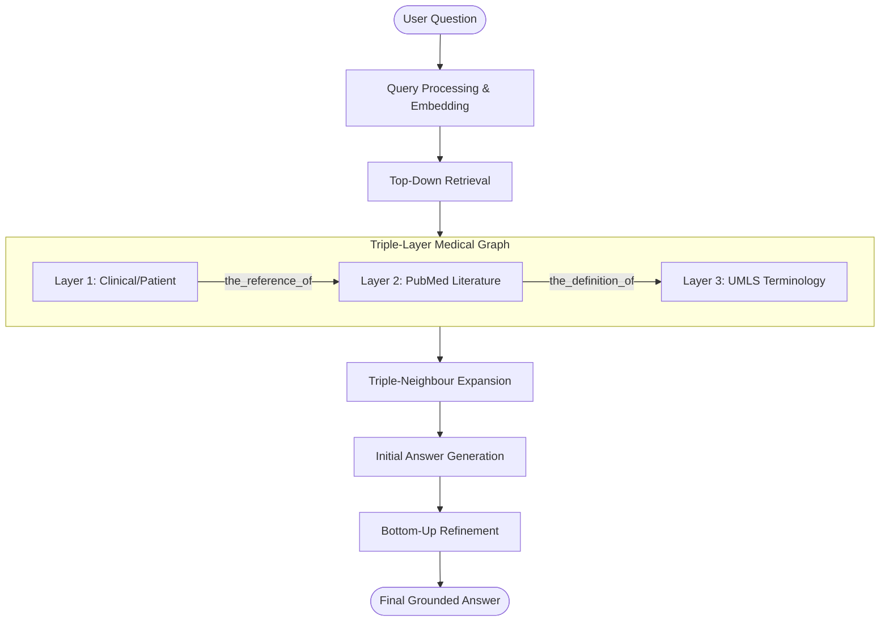

# Architecture Overview

## Layers Explained

1. **Layer 1 (Clinical/Patient)**: Patient specific data extracted via LLM (Entity-to-Entity relationship extraction) during ingestion.
2. **Layer 2 (PubMed)**: Evidentiary grounding from PubMed abstracts, pre-computed in batches.
3. **Layer 3 (UMLS)**: Core medical dictionary seeded from the UMLS metathesaurus for standardization and definition lookups.
